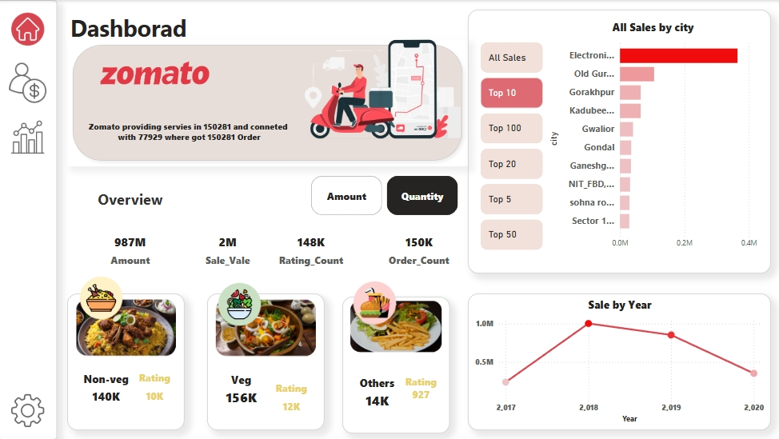

# 🍽️ Zomato Data Analysis using Power BI

This project analyzes Zomato user behavior, sales patterns, and city-wise performance using Power BI visualizations. It provides interactive dashboards to help understand user growth, order trends, food category performance, and demographic insights.

---

## 📊 Dashboards Overview

### 🧑‍💻 User Dashboard

- 👤 Active Users: 78K  
- 🧾 Total Orders: 150K  
- ⭐ Ratings Count: 148K  
- 📈 Gain & Loss by Gender:
  - Gained Users: 12K (Male: 6.5K, Female: 5.1K)
  - Lost Users: 33K (Male: 19K, Female: 14K)
- 👶 Age Distribution: Most users are aged between 20–25

---

### 🍛 Food Category Dashboard

- 🥗 Veg: 156K Orders (12K Ratings)  
- 🍗 Non-Veg: 140K Orders (10K Ratings)  
- 🍟 Others: 14K Orders (927 Ratings)  
- 💵 Revenue: ₹987M  
- 🏙️ Top Sales City: Electronic City  
- 📅 Sales Trend by Year (2017–2020)

---

### 🏙️ City Dashboard

- 🌐 Cities Covered: 150+  
- 📈 Top Performing City: Adityapur (Sales: ₹2.4M+, Orders: 448)  
- 📌 Insights on Ratings, Users, and Lost Users by City

---

## ⚙️ Tools Used
- **Power BI** – Dashboard Creation  
- **Excel** – Data Preprocessing  
- **DAX** – Measures  
- **Power Query** – Data Transformation  

---

## 📁 Project Files
- `ZomatoDashboard.pbix` – Power BI file  
- `food.xlsx` – Raw data  

---

## 🔗 Project Link  
📥 [Download from Google Drive](https://drive.google.com/drive/folders/11A1-niKDa2jPP1CDL1bJjdm3uyG482zd) 

